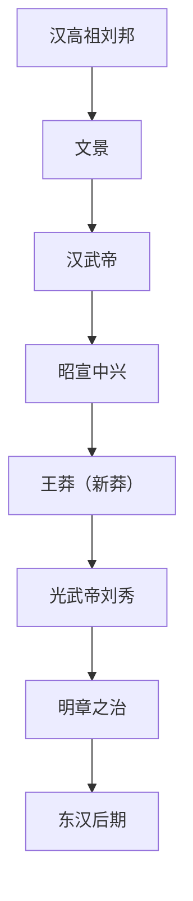

## 摘要
本文件以西汉为period_id，兼述新莽与东汉：西汉前202—8年，新莽8—23年，东汉25—220年。新莽东汉另见对应period条目。
## 原文摘录
原文略，见来源定位。不伪造长段古文。
## 白话解释
以下为现代转述，非原文：汉承秦制而休养生息，武帝拓边开西域；王莽改制失败；光武复汉后东汉延续，终因外戚宦官黄巾而衰。
## 关键人物
刘邦（约前256—前195，存疑）、汉武帝刘彻（约前156—前87，存疑）、王莽（约前45—23，存疑）、刘秀（约前5—57，存疑）。
## 关键事件
楚汉战争、文景之治、汉武开边、丝路开通、王莽改制、光武中兴、黄巾起义。
## 制度与地理
疆域文字示意（非精确）：西汉盛时东至辽东朝鲜四郡，西至西域都护，南至交趾，北至漠北；东汉大体收缩。制度：郡国并行、察举征辟、刺史监察、三公九卿演变。
## 争议与不同记载
西汉帝数含少帝争议；更始帝是否列正统存疑；王莽评价两极；丝路开通年代有多说，标争议。
## 来源与版本
《史记》《汉书》《后汉书》传世本，具体版本待考。页码待核，未能联网核验。
## 关联条目
han/emperors.yaml，han/timeline.yaml；新莽（period xin）、东汉（period han-eastern）条目另见。

<!-- manifest: {period_id:"han-western", covers:["han-western","xin","han-eastern"], files:["han/dynasty.md","han/emperors.yaml","han/power-holders.yaml","han/timeline.yaml","han/official/han-official-gaozu-001.md","han/official/han-official-wenjing-002.md","han/official/han-official-wudi-003.md","han/official/han-official-guangwu-004.md","han/folk/han-folk-zhaojun-001.md","han/folk/han-folk-zhangqian-002.md"]} -->
