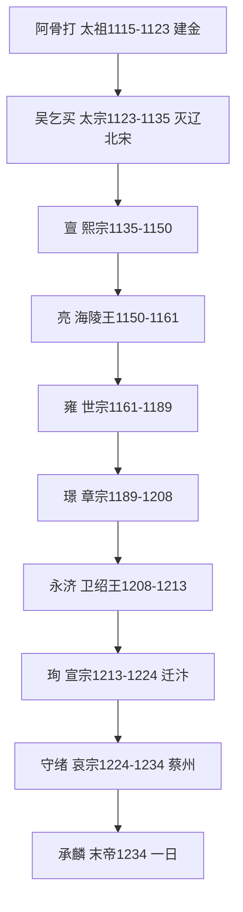

# 金朝（女真）政权史

**说明**：本文件为现代转述的政权概述，非史料原文。疆域描述为文字示意，不声称精确。人物生卒年凡不确定者标"约/存疑"。（页码待核，未能联网核验。）

## 女真兴起与灭辽灭北宋（1115—1127）

完颜阿骨打（1068—1123）1115年称帝建金，都会宁府。联宋夹攻辽，1125年灭辽；1127年靖康之变灭北宋，掳徽钦北迁。兵力掳掠数字诸书悬殊，一律存疑，见official条。

## 南北对峙与汉制（1127—1208）

金迁中都，与南宋以淮河—大散关对峙。海陵王完颜亮（约1122—1161，存疑）南侵，采石战败被杀；世宗雍、章宗璟行汉制，猛安谋克与州县并行。开禧北伐后宋金再议和。小尧舜之称出后世记述，标存疑。

## 蒙古灭金（1211—1234）

蒙古1211年南侵，1215年陷中都，金迁汴京。1232年三峰山主力覆没，1234年蒙宋联合灭金于蔡州，哀宗自缢、末帝承麟死难。传世称十帝，详见emperors.yaml。

## 帝系传承（传世谱系，详见 emperors.yaml）

太祖阿骨打、太宗吴乞买、熙宗亶、废帝亮、世宗雍、章宗璟、卫绍王永济、宣宗珣、哀宗守绪、末帝承麟。宗翰宗弼等事见 power-holders.yaml。

## 疆域文字示意（非精确地图）

极盛东至海、西与西夏为界、北至外兴安岭以南、南以淮河—大散关与宋为界。都会宁而中都而汴京。仅为文字示意，不作比例与现代边界依据。详见 maps/meta.yaml。
