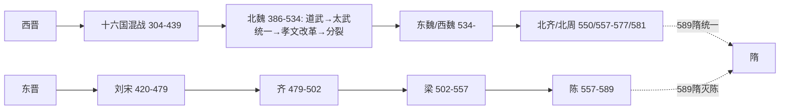

# 十六国南北朝综述(304—589,文字示意)

> 本文件 period_id 用 northern-southern,正文分"十六国/南朝/北朝"三节,符合"综述用 northern-southern但正文分南北两节"要求。疆域只作文字示意。

## 南北两节
### 北:十六国混战→北魏统一→东西分裂→北齐北周
304年刘渊建汉(前赵)、李雄建成都(成汉),十六国局面开;439年北魏太武帝统一北方;534年分东西魏,550北齐、557北周代立;577北周灭齐。

### 南:东晋→刘宋齐梁陈
420年刘裕代晋建宋,其后齐(479)、梁(502)、陈(557)递代,都建康;侯景之乱(548—552)重创南朝;589年隋灭陈,南北统一。

### 孝文改革
北魏孝文帝(471—499在位)迁都洛阳、改汉姓、断胡服等汉化改革,为北朝制度关键转折,详见 official 条。

## Mermaid 示意

## 地理文字示意(非精确)
- 北方:黄河流域为核心,平城/洛阳/邺/长安为都城转移点。
- 南方:长江下游建康为中心,江淮为南北拉锯带。
- 十六国政权此兴彼灭,不逐一划界。

## 来源
- 房玄龄等《晋书·载记》;魏收《魏书》;沈约《宋书》;萧子显《南齐书》;姚思廉《梁书》《陈书》;李百药《北齐书》;令狐德棻等《周书》;司马光《资治通鉴》。传世本,具体版本待考,页码待核,未能联网核验。
