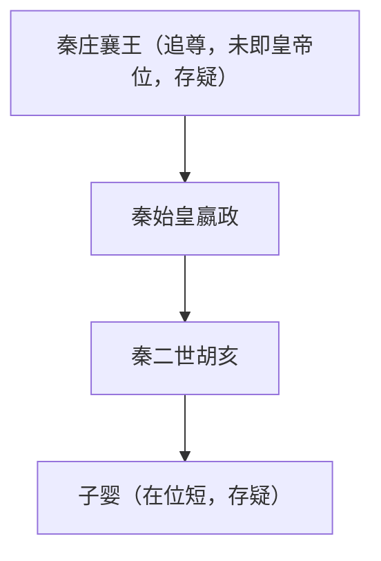

## 摘要
秦由关中诸侯经商鞅变法而强，前221年嬴政并六国称皇帝，行郡县、统一文字度量衡，前207年亡于秦末起义。本条为秦朝总纲。
## 原文摘录
原文略，见来源定位。不伪造长段古文。耳熟能详短句如“天下皆为郡县”系后世概括，非原文照录。
## 白话解释
以下为现代转述，非原文：秦始皇废分封设郡县，中央设三公九卿，地方郡守县令由皇帝直辖任免，政令统一于皇帝。
## 关键人物
嬴政（约前259—前210，存疑）、胡亥（约前230—前207，存疑）、子婴（生卒年存疑）。
## 关键事件
统一六国、称皇帝、行郡县、焚书坑儒之争议、陈胜吴广起义、巨鹿之战、刘邦入关受降。
## 制度与地理
疆域文字示意描述（非精确测绘）：东至海暨辽东，北据河套阴山并修长城，西至今甘肃东部，南至今岭南北部。制度：皇帝制、三公九卿、郡县两级、书同文车同轨、统一度量衡货币。
## 争议与不同记载
焚书坑儒范围与“坑儒”性质有争议；子婴身份为始皇孙或弟记载不一；秦速亡原因归因分歧，均标争议待考。
## 来源与版本
《史记》司马迁著，传世本，具体版本待考，卷五、卷六。页码待核，未能联网核验。
## 关联条目
qin/emperors.yaml，qin/timeline.yaml，han/dynasty.md（秦汉之际另见）。

<!-- manifest: {period_id:"qin", files:["qin/dynasty.md","qin/emperors.yaml","qin/power-holders.yaml","qin/timeline.yaml","qin/official/qin-official-shiji-001.md","qin/official/qin-official-shiji-002.md","qin/official/qin-official-shiji-003.md","qin/folk/qin-folk-mengjiang-001.md","qin/maps/qin-221-bc.svg","qin/maps/meta.yaml"]} -->
