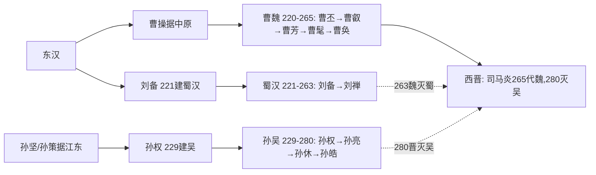

# 三国并立综述(魏蜀吴,220—280,文字示意)

> 本文件为三国综述,依"一文件一period_id"硬约束,period_id取 wei 为代表,正文分魏/蜀/吴三节叙述;shu、wu 另见各 official 条目。疆域下述仅为文字示意,非精确边界。

## 脉络
东汉末群雄并起,208年赤壁之战后形成三足雏形;220年曹丕代汉建魏,221年刘备建汉(蜀汉),229年孙权建吴,三国鼎立。263年魏灭蜀,265年司马炎代魏建晋,280年晋灭吴,三国归晋。

## Mermaid 三线传承示意

## 地理文字示意(非精确)
- 曹魏:约当黄河流域、中原、关中及辽东一带,都洛阳,后迁许昌/洛阳之间政治中心。
- 蜀汉:约当今四川盆地、汉中及云贵部分,都成都。
- 孙吴:约当长江下游、东南沿海及荆州东部,都建业(今南京一带)。
- 接触带:荆州、合肥、汉中为反复争夺区,具体界线随战事变动,不作精确描绘。

## 来源
- 陈寿《三国志》、裴松之注;房玄龄等《晋书》;司马光《资治通鉴》。版本均为"传世本,具体版本待考",页码待核,未能联网核验。
