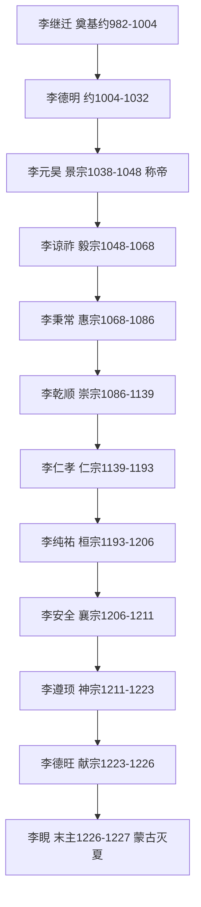

# 西夏政权史（党项）

**说明**：本文件为现代转述的政权概述，非史料原文。疆域描述为文字示意，不声称精确。人物生卒年凡不确定者标"约/存疑"。西夏汉文史料多散佚，多赖宋辽金元人记述，版本问题特须注明。（页码待核，未能联网核验。）

## 党项建国（约982—1038）

党项拓跋部唐末据夏州，李继迁（约963—1004，存疑）叛宋自立，其子李德明（约981—1032，存疑）向宋辽称臣纳贡，李元昊（1003—1048）1038年称帝建国号大夏，定都兴庆府。西夏仿宋立官制、创西夏文字，军政重镇为兴庆、凉州与黑水城。

## 宋夏和战（1040—1227）

元昊三川口、好水川连败宋军，1044年宋夏庆历和约：夏向宋称臣，宋岁赐银绢茶叶。仁宗、神宗屡兴边事，五路伐夏与永乐城之战互有胜负。金起后夏附金，绍兴和议后夏金宋三足鼎立。后期蒙古崛起，1227年成吉思汗灭夏，末主李睍被俘，史料毁坏极多，细节多存疑。

## 帝系传承（传世谱系，存疑处见 emperors.yaml）

景宗李元昊、毅宗李谅祚（约1047—1068，存疑）、惠宗李秉常、崇宗李乾顺、仁宗李仁孝、桓宗李纯祐、襄宗李安全、神宗李遵顼、献宗李德旺、末主李睍。没藏太后、梁太后垂帘与权相事见 power-holders.yaml。

## 疆域文字示意（非精确地图）

东据黄河河套、西至玉门以东与吐蕃诸部为邻、北至大漠戈壁、南抵秦凤横山一线与宋为界。核心为今宁夏、陕北、陇东与河西走廊东段。以上仅为文字示意，不作比例与现代边界依据。详见 maps/meta.yaml。
