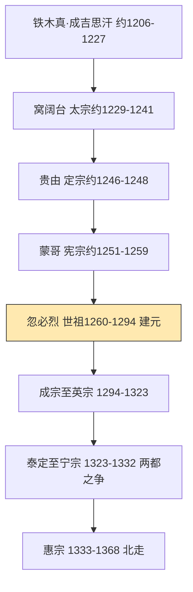

# 元朝（蒙古—大元）政权史

**说明**：本文件为现代转述的政权概述，非史料原文。疆域描述为文字示意，不声称精确。人物生卒年凡不确定者标"约/存疑"。（页码待核，未能联网核验。）

## 蒙古统一与大汗时期（约1206—1260）

铁木真（约1162—1227，存疑）1206年传称成吉思汗，建大蒙古国于和林。窝阔台（约1186—1241，存疑）灭金（1234）并西征；贵由、蒙哥延续扩张。蒙哥传称崩于合州，诸王争汗位。灭夏灭金数字诸书悬殊，一律存疑。

## 世祖建元与统一（1260—1279）

忽必烈（1215—1294）1260年称汗，1271年建国号大元，定都大都。1276年陷临安，1279年崖山后宋亡，元统一。制度立中书省、行省制，宣政院辖吐蕃，设万户、站赤，海运钞法并行。四等说出后世概括，标争议。

## 中后期与元亡（1294—1368）

成宗以后武宗、仁宗（延祐复科）、英宗（新政被弑）相继即位，继而两都之争。惠宗妥懽帖睦尔（约1320—1370，存疑）在位，权归伯颜、脱脱。至正水患，1351年红巾起义，1368年明军入大都，顺帝北走，元亡于中原。

## 帝系传承（传世谱系，详见 emperors.yaml）

太祖铁木真、太宗窝阔台、定宗贵由、宪宗蒙哥；世祖忽必烈、成宗铁穆耳、武宗海山、仁宗爱育黎拔力八达、英宗硕德八剌、泰定帝也孙铁木儿、天顺帝阿速吉八、文宗图帖睦尔、明宗和世㻋、宁宗懿璘质班、惠宗妥懽帖睦尔。摄政权臣见 power-holders.yaml。

## 疆域文字示意（非精确地图）

大元直辖东至海、西至吐蕃云南、南至南海声威所及、北至漠北岭北行省；四大汗国分立后仅为羁縻关系。以上仅为文字示意，不作比例、海岸线与现代边界依据。详见 maps/meta.yaml。
